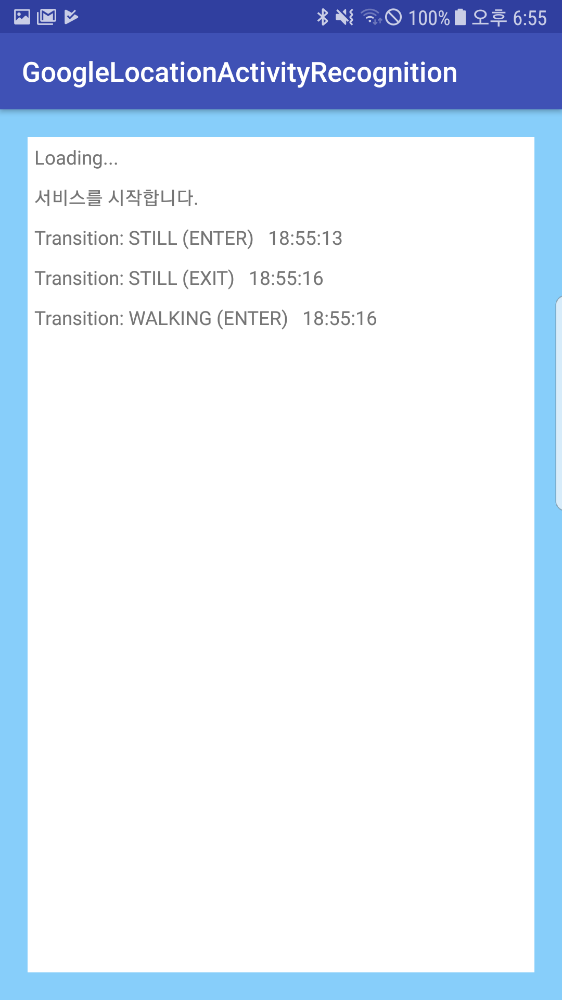

# activity-recognition-transition


이제부터 안드로이드에서 사용자가 어떤 활동을 하고 있는지 쉽게 알 수 있습니다.

Google의 Activity Recognition Transition API를 소개합니다.

</br>

## [Activity Recognition Transition API 란?]

1. 사용자의 활동 상태를 인식해주는 API다. 
2. 엄밀히 말하면 핸드폰(디바이스)의 활동 상태라고 할 수 있다.
3. 사용자가 핸드폰과 같이 있다는 전제하에 사용자의 활동 상태를 인식한다.

</br>
<sup>[1]</sup>[이 곳](https://developers.google.com/android/reference/com/google/android/gms/location/DetectedActivity)에 따르면 사용자의 활동 상태를 6가지로 분류시켜 앱에 알릴 수 있습니다. 

```
IN_VEHICLE : 디바이스(사용자)가 차량을 이용하는 중이다.
ON_BICYCLE : 디바이스(사용자)가 자전거를 이용하는 중이다.
ON_FOOT    : 디바이스가 사용자와 같은 곳에 있다.
RUNNING    : 디바이스(사용자)가 뛰고 있다.
WALKING    : 디바이스(사용자)가 걷고 있다.
STILL      : 디바이스(사용자)가 움직이지 않고 머물고 있다.
```

</br>

## [개발 배경]

1. 기존에 유사한 기능을 구현하기 위해 개발자는 사용자의 위치, 센서 데이터와 같은 다양한 신호를 결합하는데 기회비용이 컸다.
2. 설사 기능을 구현했다 하더라도 사용자의 활동 변화를 지속적으로 확인하며 배터리 수명을 단축시키곤 했다.
3. 구글은 이러한 이유로 모든 처리를 간단하게 할 수 있는 API 제공하기 시작했다.

</br>

## [사전 요구사항]

- Android API Level > v14
- Android Build Tools > v21

</br>

## [구현 하기]

<sup>[2]</sup>[Activity Recognition Transition API](https://codelabs.developers.google.com/codelabs/activity-recognition-transition/#0) 클릭

</br>

## [구현 시 참고사항]


- `AndroidManifest.xml`에 권한설정을 한다.

```
<?xml version="1.0" encoding="utf-8"?>
<manifest xmlns:android="http://schemas.android.com/apk/res/android"
    package="app.kong.googlelocationactivityrecognition">
	...
    <uses-permission android:name="com.google.android.gms.permission.ACTIVITY_RECOGNITION" />
	...
</manifest>
```
</br>

- app module level 에서 `build.gradle`에 dependencies를 설정한다.

```
dependencies {
	 ...
    implementation 'com.google.android.gms:play-services-location:15.0.1' // 12.0.0 이상
    ...
}
```
</br>

- `List<ActivityTransition>` 를 생성한다.

```
     var transitions : MutableList<ActivityTransition> = mutableListOf<ActivityTransition>()
        transitions.add(
                ActivityTransition.Builder()
                        .setActivityType(DetectedActivity.WALKING)
                        .setActivityTransition(ActivityTransition.ACTIVITY_TRANSITION_ENTER) 
                        .build()) // 걷기에 돌입하면 이벤트 발생
        transitions.add(
                ActivityTransition.Builder()
                        .setActivityType(DetectedActivity.WALKING)
                        .setActivityTransition(ActivityTransition.ACTIVITY_TRANSITION_EXIT)
                        .build()) // 걷기를 멈추면 이벤트 발생
        transitions.add(
                ActivityTransition.Builder()
                        .setActivityType(DetectedActivity.STILL)
                        .setActivityTransition(ActivityTransition.ACTIVITY_TRANSITION_ENTER)
                        .build()) // 한곳에 머물기 시작하면 이벤트 발생
        transitions.add(
                ActivityTransition.Builder()
                        .setActivityType(DetectedActivity.STILL)
                        .setActivityTransition(ActivityTransition.ACTIVITY_TRANSITION_EXIT)
                        .build()) // 다른 곳으로 이동하기 시작하면 이벤트 발생
```
</br>

- BroadcastReiceiver.onReceive() 구현

```
    inner class TransitionsReceiver : BroadcastReceiver() {
        override fun onReceive(context: Context?, intent: Intent?) {
            ...
            if (ActivityTransitionResult.hasResult(intent)) {
                val result = ActivityTransitionResult.extractResult(intent)
                result?.let {
                    for (event in it.transitionEvents) {
                        ...
                    }
                }
            }
        }
    }
```
</br>

- PendingIntent 생성 후 BroadcastReiceiver 등록

```
                var intent = Intent(TRANSITIONS_RECEIVER_ACTION)
                mPendingIntent = PendingIntent.getBroadcast(this, 0, intent, 0)
                mTransitionsReceiver = TransitionsReceiver()
                registerReceiver(mTransitionsReceiver, IntentFilter(TRANSITIONS_RECEIVER_ACTION))

                val request = ActivityTransitionRequest(transitions)
                val task = ActivityRecognition.getClient(this).requestActivityTransitionUpdates(request, mPendingIntent)
                task.addOnSuccessListener {
                    // Handle success
						...
                }
                task.addOnFailureListener {
                    // Handle error
						...
                }
```
</br>

- 자세한 내용은 [MainActivity.kt](.app/src/main/java/app/kong/googlelocationactivityrecognition/MainActivity.kt) 를 참고. 

</br>

## [사용 후기]

현재 테스트 앱을 제작하였습니다. (아래 화면 참조)
인식률에 대해 테스트 후 업데이트 하도록 하겠습니다.




</br>

## [참조 문서]


[1] DetectedActivity : https://developers.google.com/android/reference/com/google/android/gms/location/DetectedActivity

[2] Google codelab : https://codelabs.developers.google.com/codelabs/activity-recognition-transition/#0
